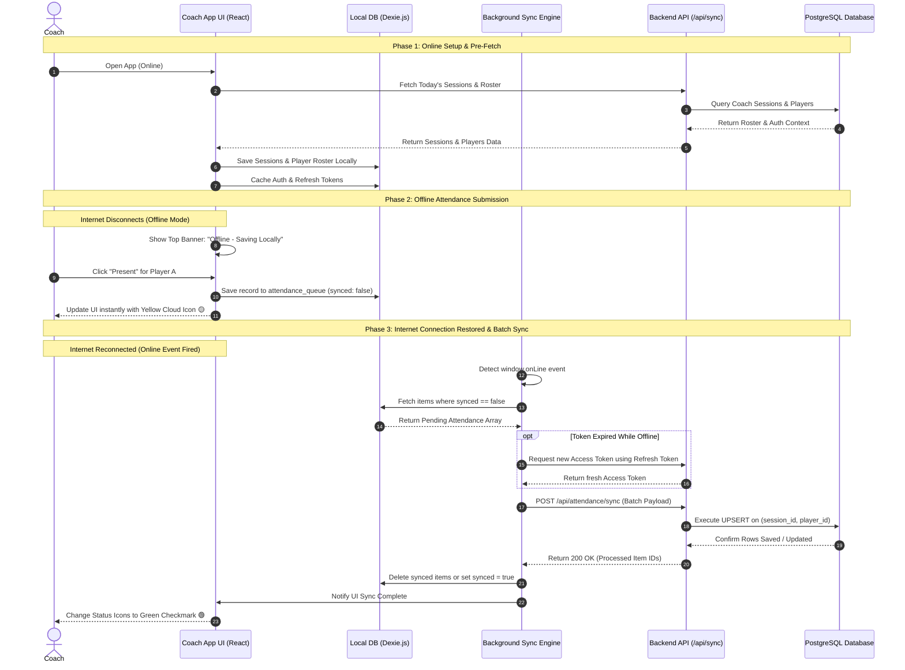
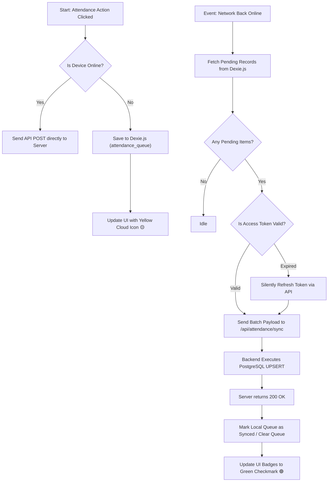

 # Offline Attendance Submission Strategy & Architecture

This document outlines the simplified, step-by-step strategy for handling **offline attendance submission** for coaches in the sports academy application.

---

## 1. Executive Strategy Overview

When coaches conduct training on fields with poor or zero network connectivity, they need to view session rosters, mark player attendance, and have confidence that their work is saved and synced seamlessly when internet access is restored.

### Core Objectives
1. **Instant UI Feedback**: Coach marks attendance offline without app lag or error popups.
2. **Zero Data Loss**: Offline records are persisted locally in IndexedDB using `Dexie.js`.
3. **Automatic Reconnection Sync**: The system auto-syncs pending records in a single batch when online.
4. **Idempotency & Duplicate Prevention**: Server uses DB `UPSERT` operations to ensure retries do not create duplicate records.

---

## 2. Tech Stack Recommendations

| Component | Technology | Purpose |
| :--- | :--- | :--- |
| **Frontend Framework** | React / Next.js | Modern UI rendering and component state |
| **Local Offline Storage** | IndexedDB via `Dexie.js` | Fast, structured, asynchronous browser storage |
| **Network Detection** | `navigator.onLine` & Event Listeners | Detects internet state changes (`online` / `offline`) |
| **Backend API** | Node.js / Next.js API Routes | Batch sync processing endpoint (`/api/attendance/sync`) |
| **Database** | PostgreSQL (via Prisma / Supabase) | Main database with `UPSERT` constraint on `(session_id, player_id)` |

---

## 3. The 4 Key Components

### a] UI Management (Offline Mode)
* **Status Bar**: Small non-intrusive top banner when offline:  
  `"You are offline. Attendance is saved locally and will sync when internet returns."`
* **Optimistic UI Indicators**:
  * Clicking **Present / Absent / Late** instantly updates the UI state.
  * Displays a **Yellow Cloud Icon** 🟡 next to offline-marked attendance.
  * Switches to a **Green Checkmark** 🟢 once synced to the cloud.

### b] Offline Data Management (`Dexie.js` Schema)
The local database stores two datasets:
1. **Read-only Cached Roster**: Sessions and player lists pre-fetched while online.
2. **Write Queue (`attendance_queue`)**: Local pending changes.

```javascript
// Dexie.js Schema Example
import Dexie from 'dexie';

const db = new Dexie('AllstarsOfflineDB');
db.version(1).stores({
  cached_rosters: 'sessionId, academyId, locationId',
  attendance_queue: 'id, sessionId, playerId, status, synced, markedAt'
});
```

### c] Authentication & Authorization Management
* **While Online**: App caches Coach Profile, Role permissions, Access Token, and Refresh Token in local storage.
* **While Offline**: The app allows coaches to view their pre-fetched sessions and record attendance based on cached permissions without forcing logouts.
* **During Reconnection**: If the Access Token expired while offline, the background sync manager silently exchanges the **Refresh Token** for a new Access Token *before* pushing the queued records to the server.

### d] Network Sync Strategy
1. **Detection**: `window.addEventListener('online', triggerSync)` executes automatically.
2. **Fetch Pending Queue**: Reads all items from `attendance_queue` where `synced === false`.
3. **Batch POST API Call**: Sends array of pending actions to `/api/attendance/sync`.
4. **Database UPSERT**: Backend processes the queue using SQL `ON CONFLICT (session_id, player_id) DO UPDATE`.
5. **UI Update**: On HTTP 200 OK response, local queue items are marked `synced = true` (or purged), and UI icons update to Green Checkmarks.

---

## 4. End-to-End Sequence Diagram



---

## 5. Offline Sync Process Flowchart



---

## 6. Summary Checklist for Developers

- [ ] Install `dexie` package for IndexedDB local storage.
- [ ] Create `attendance_queue` store with `synced` flag and timestamp.
- [ ] Add `useNetworkStatus` hook to track online/offline status in UI.
- [ ] Implement batch sync endpoint `/api/attendance/sync` supporting array of records.
- [ ] Ensure DB query uses PostgreSQL `ON CONFLICT (session_id, player_id) DO UPDATE`.
- [ ] Test offline behavior by turning on Chrome DevTools "Offline" throttling mode.
